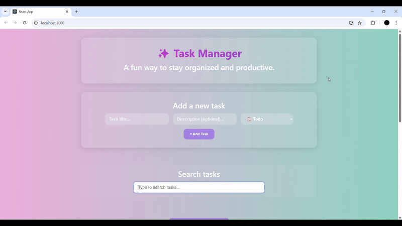
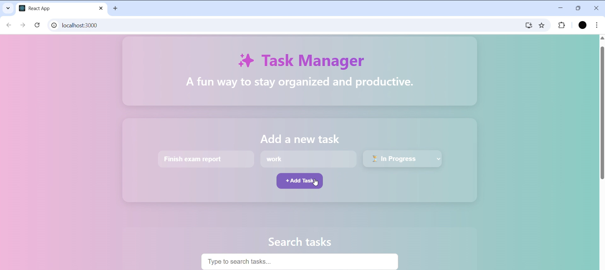
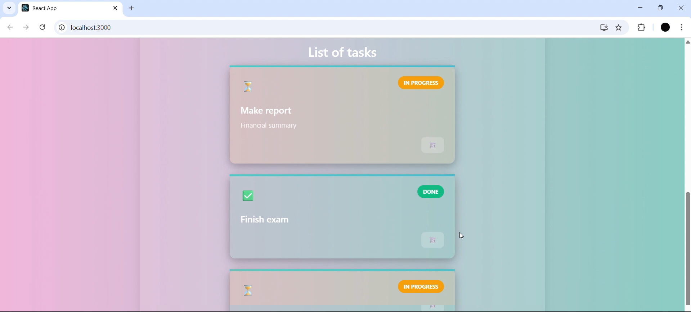
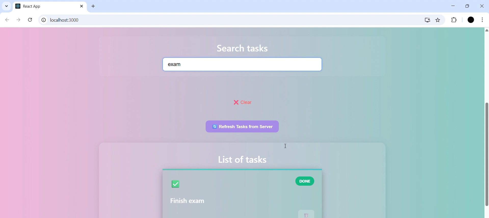

# ✨ Task Manager App
A beautiful, full-stack task management web application built with React, Flask, and PostgreSQL. This app lets users create, view, manage, and search tasks with a user-friendly interface.


# Tech Stack
Frontend: React, TailwindCSS / Custom CSS

Backend: Flask (Python)

Database: PostgreSQL (with optional Sklearn and sentence_transformers for vector similarity search)

ORM: SQLAlchemy

Containerization: Docker + Docker Compose

# Features
✅ Add / Edit / Delete tasks

📂 Categorize by status (Todo, In Progress, Done)

🔍 Real-time task search

🌐 REST API integration with React frontend

🐳 Fully containerized using Docker

🧠 (Optional) Vector search for task similarity (using Sentence Transformers + pgvector)

🚀 Live Demo



The full demo video is available in the file: /task manager 2.mp4


# Local Development
1. Clone the Repository

git clone https://github.com/yourusername/task-manager-app.git
cd task-manager-app

2. Environment Setup (Docker)

docker-compose up --build
Frontend will be available at: http://localhost:3000
Backend will be available at: http://localhost:5000

# Project Structure

```bash
task-manager-app/
│
├── backend/
│   ├── app.py
│   ├── models.py
│   ├── requirements.txt
│   └── ...
│
├── frontend/
│   ├── src/
│   │   ├── App.js
│   │   ├── App.css
│   │   └── ...
│   └── ...
│
├── docker-compose.yml
├── README.md
└── ...
```

# Screenshots

Add Task



List of Tasks



Searching for task based on description similarity



# API Endpoints
GET method: Endpoint =	/tasks, Description = Get all tasks
POST method: Endpoint =		/tasks, Description = 	Create a task
DELETE method: Endpoint =		/tasks/<id>, Description = 	Delete a task
GET method: Endpoint =	/search?q=term, Description = 	Search tasks by title

# Acknowledgements
Flask
React
pgvector
Sentence Transformers
